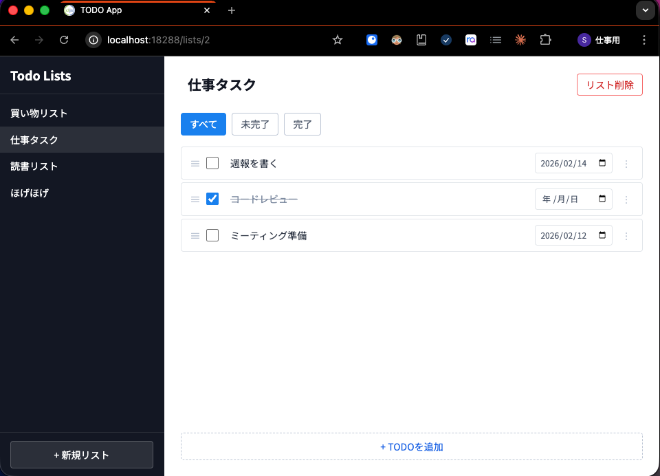

# スキルマッチ選考課題

Clojure/ClojureScript フルスタック TODO アプリケーションを題材にした実装課題です。

## 前提条件

以下のツールを事前にインストールしてください。

### Docker 環境

コンテナでアプリケーションを実行します。いずれかをインストールしてください。

- [Docker Desktop](https://www.docker.com/products/docker-desktop/) — Windows / macOS / Linux 対応
- [OrbStack](https://orbstack.dev/download) — macOS 向けの軽量な代替 (推奨)

### エディタ

Clojure 開発には REPL 連携が重要です。以下の組み合わせを推奨します。

- [Visual Studio Code](https://code.visualstudio.com/)
- [Calva](https://marketplace.visualstudio.com/items?itemName=betterthantomorrow.calva) — VS Code の Clojure/ClojureScript 拡張
  - インストール: VS Code の拡張機能パネルで「Calva」を検索してインストール
  - 公式ガイド: https://calva.io/getting-started/

## 進め方

1. このリポジトリを **Fork** してください
2. `problem/` ディレクトリの README.md に記載されている事前課題に取り組んでください
3. 完了したら commit し、スキルマッチ選考当日に取り組み内容を解説してください

## ディレクトリ構成

```
problem/   課題 (こちらで作業してください)
```

## 事前課題の概要

TODO アプリの以下の2つの事前課題に取り組みます。

| # | 内容                    | 難易度 | 領域           |
|---|-------------------------|--------|----------------|
| 1 | アイテム更新 API の実装 | ★★☆    | バックエンド   |
| 2 | フィルター機能の接続    | ★★☆    | フロントエンド |

選考当日は、上記に加えてバックエンド・フロントエンドにまたがる機能追加にも取り組んでいただきます。

詳細は `problem/README.md` を参照してください。

## TODOアプリケーションの完成形


